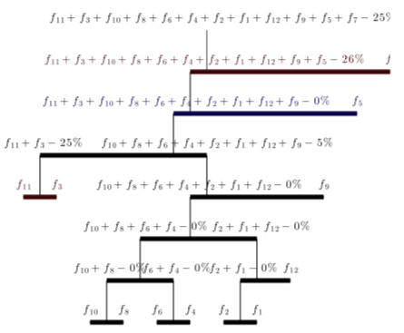
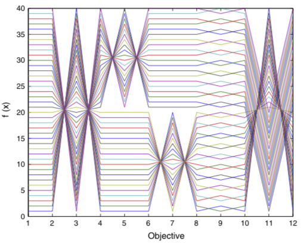
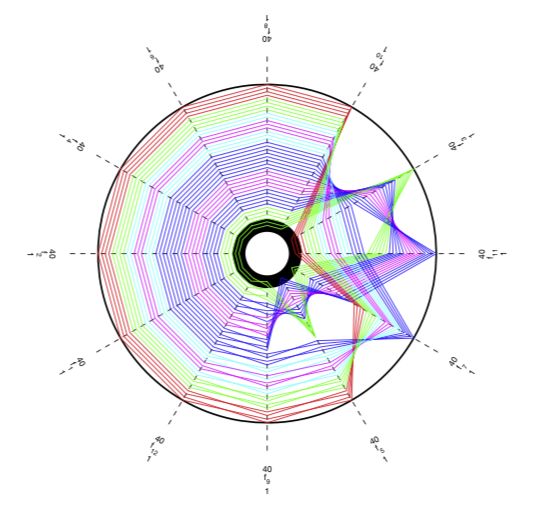

# Aggregation Trees



## White paper

Reference:

* Aggregation Trees for Visualization and Dimension Reduction in Many-Objective Optimization.
 *ARR de Freitas, PJ Fleming, FG Guimarães* - Information Sciences, 2014 - Elsevier

## Generating an Aggregation Tree

Loading the data for the example:

```MATLAB
load example_data;
```

Usual parallel coordinate plot with clusters to facilitate visualization:

```MATLAB
figure(3);
tradeoff(obj);
```



Aggregation Trees with Polar Graph (polar graph with clusters to facilitate visualization):

```MATLAB
figure(1);
AT(obj);
```


You can interpret the tree by looking at percentages and colors:
* Percentages
    * The percentages represent the amount of conflict between pairs of objectives. 
* Colors
    * **Red**der branches indicate the conflict is mostly between good values for these objectives. This is danger because these are the values we are worried about.
    * **Blue**r branches indicate the conflict is mostly between bad values for these objectives. This is not as bad because these are not the values we care about.
    * **Black**er branches indicate that either:
        * There is no much conflit (look at the percentage) or...
        * The conflict is everywhere.

The respective Polar Graph is:



The polar graph uses the aggregation tree to organize the order of objectives such that objectives with less conflict are placed together. 

## Syntax 

The function ``AT`` has the following syntax:

```MATLAB
function [ t, obj_order ] = AT( Points, minimization, normalization )
```

The function generates an ***Aggregation Tree*** for the points in the variable:
 
 * `Points`. The variable `Points` has a row for each point and a column for each objective. 
 * `Minimization` is `1` for minimization and `0` for maximization (it can be a vector)

The file `example_data.mat` contains a set of data points that can be used for tests:

```matlab
load example_data;
```

The package also includes a function for generating parallel coordinates:

```matlab
tradeoff(obj);
```

The Aggregation Tree (with Polar Graph) can be generated with:

```matlab
AT(obj);
```